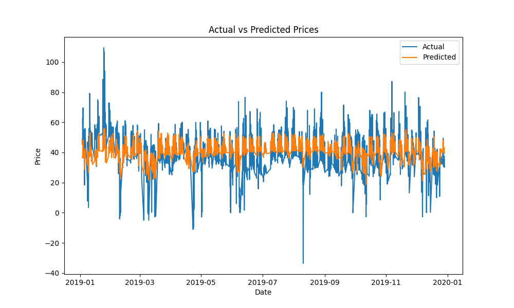
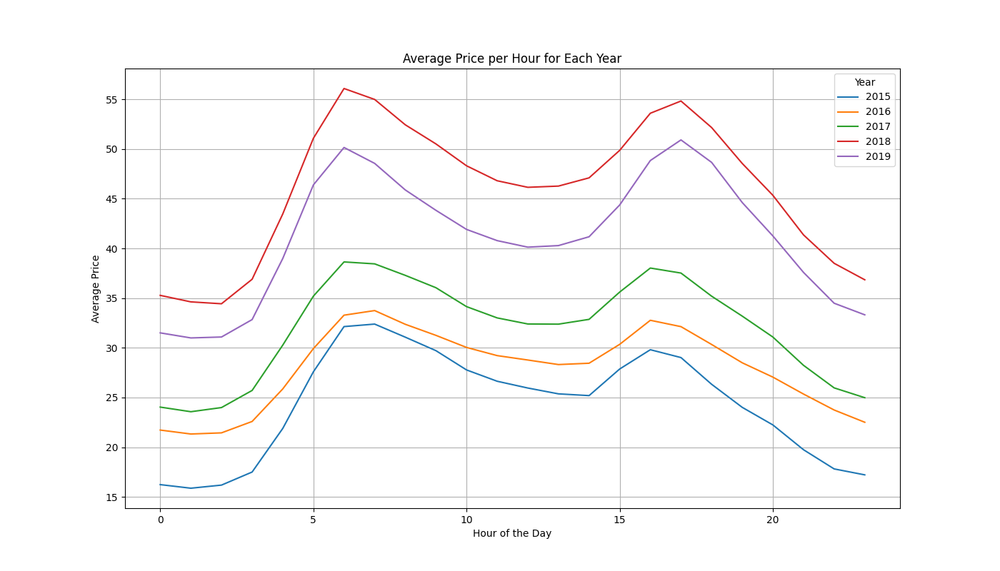

# Day-Ahead Electricity Price Prediction for DK1 Bidding Zone

This project predicts the day-ahead electricity prices in the DK1 bidding zone in Denmark. It uses machine learning models to forecast prices based on various features like load, renewable energy generation, and weather data.

## Key Results

Here are some of the key results from the analysis:

### Feature Importance

### Actual vs. Predicted Prices

### Average Price per Hour for Each Year

### RMSE by Month and Hour

## Full Report

For a more detailed analysis, please see the full report:

[Model Performance Report](output/model_performance_report.pdf)
